# Workflow DAG Flowchart

```mermaid
flowchart LR
  %% =========================
  %% Module: Control & Routing
  %% =========================
  subgraph M0["Control / Routing Module"]
    N01["N01 receive_request<br/>service: fastapi"]
    N02["N02 resolve_provider_policy<br/>service: provider_router"]
    N03["N03 build_agent_plan<br/>agent: planner_agent"]
    N03A["N03A load_ontology_guidance<br/>service: ontology_registry"]
    N01 --> N02 --> N03 --> N03A
  end

  %% =========================
  %% Module: Ingestion Chain
  %% =========================
  subgraph M1["Ingestion Chain"]
    N04["N04 parse_pdf<br/>tool: pdf2String_local_bestFilter"]
    N05["N05 chunk_text<br/>chain: langchain_text_splitter"]
    N04 --> N05
  end

  %% =========================
  %% Module: Extraction Chain
  %% =========================
  subgraph M2["Extraction Chain"]
    ONT[("Ontology Guidance Snapshot")]
    N06["N06 extract_artifacts_by_agent<br/>agent: extraction_agent"]
    N06A["N06A evidence_grounding_gate<br/>tool: evidence_grounding_validator"]
    N06B["N06B enforce_ontology_schema<br/>service: ontology_schema_validator"]
    N07["N07 normalize_entities<br/>tool: Dataset_KnowledgeGraph logic"]
    ONT --> N06 --> N06A --> N06B --> N07
  end

  %% =========================
  %% Module: Verification Tools
  %% =========================
  subgraph M3["Verification Tools Module"]
    N08["N08 verify_access_and_liveness_by_agent<br/>agent: verification_agent"]
    N08A["N08A magic_byte_inspection<br/>tool: magic_byte_inspector"]
    N08B["N08B enrich_external_value_signals<br/>tool: external_signal_enricher (OpenAlex etc.)"]
    N08C["N08C classify_availability_stages<br/>service: availability_stage_classifier"]
    N08 --> N08A --> N08B --> N08C
  end

  %% =========================
  %% Module: Scoring Chain
  %% =========================
  subgraph M4["Scoring Chain"]
    N09["N09 compute_scores_by_agent<br/>agent: scoring_agent (base scores)"]
    N09A["N09A passive_mention_scoring<br/>tool: passive_mention_classifier"]
    N09 --> N09A
  end

  %% =========================
  %% Module: Quality Review
  %% =========================
  subgraph M5["Quality Review Module"]
    N10["N10 cross_agent_review<br/>agent: reviewer_agent"]
  end

  %% =========================
  %% Module: Reporting Chain
  %% =========================
  subgraph M6["Reporting Chain"]
    N11["N11 generate_reports<br/>chain: report_synthesis + DDI report"]
    N11A["N11A build_dashboard_payload<br/>service: dashboard_assembler"]
    N11 --> N11A
  end

  %% =========================
  %% Module: Knowledge Update Chain
  %% =========================
  subgraph M7["Knowledge Update Chain"]
    N12["N12 update_knowledge_assets<br/>tool: graph/vector/kv update"]
    N13["N13 finalize<br/>service: job_registry"]
    N12 --> N13
  end

  %% =========================
  %% Main Flow Connections
  %% =========================
  N03 --> N04
  N05 --> N06
  N03A --> ONT
  N07 --> N08 --> N08A --> N08B --> N08C --> N09 --> N09A --> N10 --> N11 --> N11A --> N12

  %% Feedback loop: Knowledge -> Ontology -> Extraction
  N12 -. "ontology_update_event<br/>(async_next_run)" .-> ONT

  %% =========================
  %% Outputs
  %% =========================
  subgraph M8["Outputs"]
    O1["artifact_report_json"]
    O2["paper_value_report_json"]
    O3["ddi_report_json"]
    O4["dashboard_payload_json"]
    O5["artifact_report_md"]
    O6["paper_value_report_md"]
    O7["kb_update_record"]
    O8["trace_log"]
    O9["provider_usage"]
  end

  N13 --> O1
  N13 --> O2
  N13 --> O3
  N13 --> O4
  N13 --> O5
  N13 --> O6
  N13 --> O7
  N13 --> O8
  N13 --> O9

  %% =========================
  %% Branching / Exception Rules
  %% =========================
  R1{"R01<br/>extraction_confidence &lt; 0.65"}
  A1["rerun N06 with fallback provider"]
  N06 -.-> R1
  R1 -- yes --> A1 --> N06
  R1 -- no --> N06A

  R1A{"R01A<br/>evidence_coverage_ratio &lt; 0.70"}
  A1A["rerun N06 with strict evidence prompt<br/>smaller chunks"]
  N06A -.-> R1A
  R1A -- yes --> A1A --> N06
  R1A -- no --> N06B

  R1B{"R01B<br/>schema_violation_rate &gt; 0.10"}
  A1B["route to ontology curation queue<br/>repair once"]
  Q1["ontology_curation_queue"]
  N06B -.-> R1B
  R1B -- yes --> A1B --> Q1
  R1B -- no --> N07

  R2{"R02<br/>network_failure_rate &gt; 0.50"}
  A2["use cached verification<br/>mark degraded"]
  N08 -.-> R2
  R2 -- yes --> A2 --> N08A
  R2 -- no --> N08A

  R2A{"R02A<br/>magic_byte_mismatch_ratio &gt; 0.30"}
  A2A["mark functionally dead<br/>penalize availability"]
  N08A -.-> R2A
  R2A -- yes --> A2A --> N08B
  R2A -- no --> N08B

  R2B{"R02B<br/>freshness_signal_coverage &lt; 0.40"}
  A2B["fallback to internal timeline<br/>mark freshness uncertainty"]
  N08B -.-> R2B
  R2B -- yes --> A2B --> N08C
  R2B -- no --> N08C

  R3{"R03<br/>output_schema_invalid"}
  A3["force repair and revalidate once"]
  N11 -.-> R3
  R3 -- yes --> A3 --> N11

  R4{"R04<br/>review_agreement &lt; 0.60"}
  A4["escalate to human review queue"]
  H1["human_review_queue"]
  N10 -.-> R4
  R4 -- yes --> A4 --> H1
  R4 -- no --> N11

  R5{"R05<br/>provider_error_count &gt;= 2"}
  A5["switch to next provider in fallback order"]
  N02 -.-> R5
  R5 -- yes --> A5 --> N02
  R5 -- no --> N03

  R6{"R06<br/>passive_mention_ratio &gt; 0.50"}
  A6["apply passive mention penalty<br/>raise review priority"]
  N09A -.-> R6
  R6 -- yes --> A6 --> N10
  R6 -- no --> N10
```

## Notes

- Source of truth: `AutoWorkFlow/blueprints/02_workflow_dag.yaml`
- This version explicitly aligns with paper-method requirements:
  - evidence-first grounding gate + ontology schema enforcement
  - mandatory Magic Byte inspection
  - external value signal enrichment + staged availability modeling
  - independent passive mention scoring submodule
  - DDI report and dashboard payload outputs
